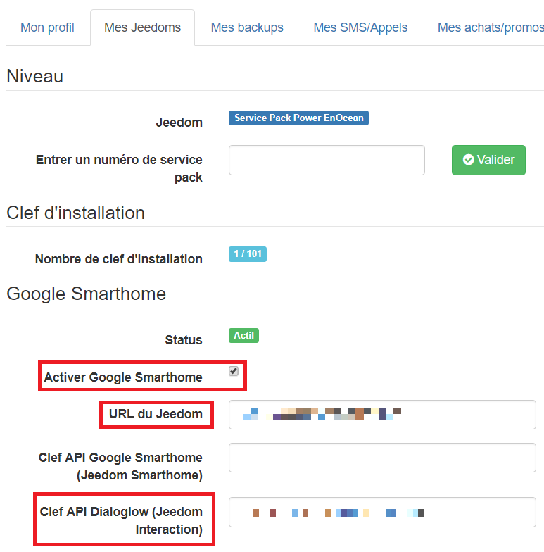
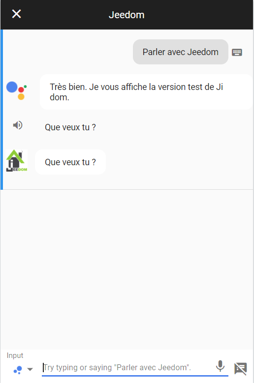
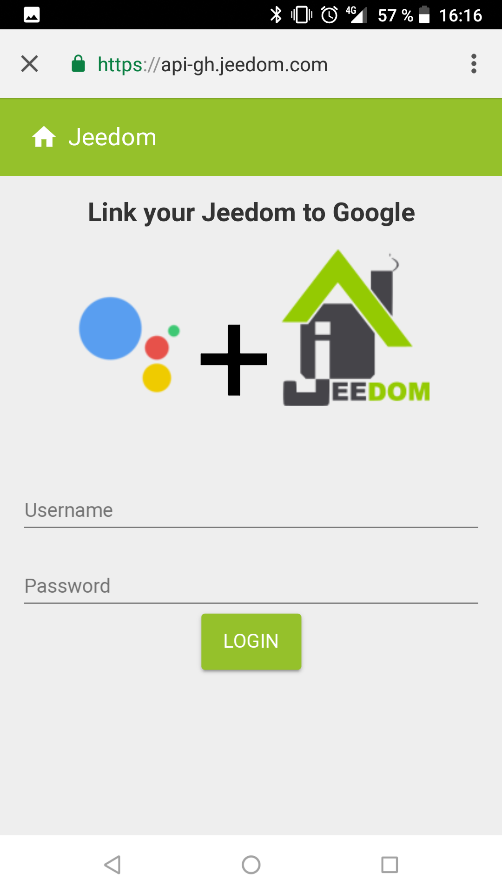
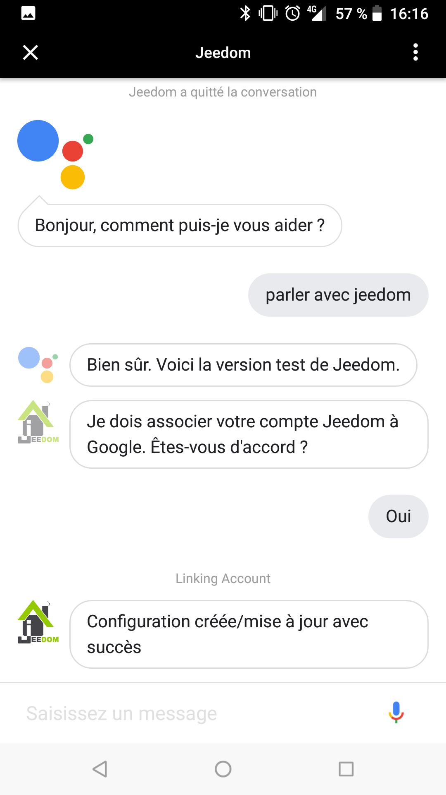

# Presentation

Le plugin dialogflow permet de connecter Jeedom à Google Home/Assitant par une application native et les interactions

> **NOTE**
>
> Il existe aussi le plugin Google Smarthome qui permet de connecter Jeedom à Google Home/Assitant mais cette fois par le bias de l'intégration Smarthome de Google, celui-ci n'utilise donc pas les intéractions. CE PLUGIN N'EST PAS ENCORE DISPONIBLE

# Setup

Install the plugin and activate it. Then go to the Plugin -> Communication -> Dialog flow page.

> **IMPORTANT** 
> 
> You do not have to create equipment for this plugin. Just follow the instructions below.

Sur le market il vous faut activer "Google Smarthome" dans l'onglet "Mes Jeedoms" à partir de votre profils et renseigner les champs : 

- URL du Jeedom (HTTPS obligatoire sinon votre configuration ne passera jamais active)
- Clef API Dialoglow (Jeedom Interaction) : vous la trouverez sur la page d'administration de Jeedom, onglet API

> **NOTE**
>
> Vous ne pouvez connecter que un seul Jeedom à Google par compte market

> **IMPORTANT**
>
> Suite à l'activation et/ou modification des informations pour Google Smarthome il faut **attendre 24h** pour que cela soit prise en compte

Sur un téléphone avec Google Assistant, dites "Parler avec Jeedom", Google va vous indiquer qu'il faut lier votre compte Jeedom et Google cliquez sur oui : 

Indiquez vos identifiants market : 

Google va vous indiquer que la configuration est crée/mise à jour avec succès : 

That's it, the link between your Jeedom and Google Home / Assistant is done.

You can now talk to your Jeedom and use all the interactions of your Jeedom directly from your Google Home / Assistant.
From your Google Home / Assistant, just say "Speak to Jeedom", "Ask Jeedom" or "Tell Jeedom" to start the interaction with Jeedom and "Thank you" when you're done to close the conversation.

# Mode sécurisé

Le mode sécurisé rajoute une couche d'autorisation au niveau de Jeedom. Par defaut seul la clef API est nécessaire en mode securisé il y a une 2eme chaine de caractère unique par utilisateur (non stocker completement en base) qui doit etre valide.

Pour s'en servir rien de plus simple il faut aller sur la page de configuration du plugin et activer le mode sécurisé, ensuite vous faite une demande à Google pour Jeedom. Enfin aller sur la page Plugin -> Communication -> Dialogflow vous allez voir une demande d'acceptation d'identifiant il suffit de la valider.

> **NOTE**
>
> Le mode sécurisé n'est pas actif par défaut pour pouvoir passer la validation Google mais il est grandement conseillé de l'activer

# Remise à zéro de la configuration

Si vous avez mis une mauvais URL ou clef API il faut faire un reset de la configuration puis refaire la procedure de connexion voila comment faire.

Allez sur le market et corriger l'information, attendre 24h (il faut absolument que la configuration passe en actif).

Ensuite sur l'application Google Assistante, dites "Parler à Jeedom" puis "Supprimer configuration". L'application devrait vous dire que la configuration est supprimée avec succès. Ensuite refaite la procedure de connexion.

# FAQ

>**Google me dit que l'application n'est pas disponible**
>
>L'application est pour l'instant limité géographiquement à la métropole France. Nous l'ouvrir dans un second après les premiers retour

>**J'ai l'erreur ESOCKETTIMEDOUT**
>
>C'est que votre URL ou la clef API configurée sur le market n'est pas bonne
