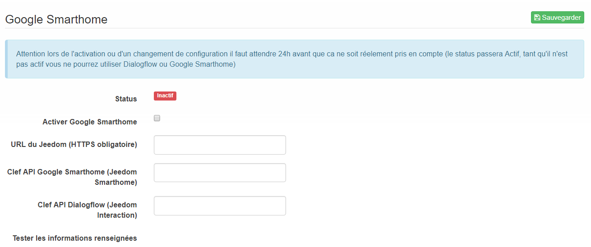

# Presentación

Le plugin dialogflow permet de connecter Jeedom à Google Home/Assitant par une application native.

# Configuración

Installez le plugin et activez-le. Ensuite allez sur la page Plugin -> Communication -> Dialog flow.

> **IMPORTANT**
>
> Vous n'avez pas à créer d'équipement pour ce plugin. Il vous suffit de suivre les instructions ci-dessous.

Sur votre Google Home ou sur un téléphone avec Google Assistant, dites "Parler avec Jeedom" :

Sur votre Google Home ou sur un téléphone avec Google Assistant, dites "Code" :

Sur Jeedom sur la page du plugin, cliquez sur le bouton code :

et donnez le code généré à Google Home/Assistant (le code est valide 5 min) :

Retournez ensuite sur Jeedom et rafraîchissez la page. Vous allez avoir une demande d'acceptation d'un utilisateur Google, il vous faut la valider :

Voilà, le lien entre votre Jeedom et Google Home/Assistant est fait.

Vous pouvez maintenant parler à votre Jeedom et utiliser toutes les interactions de votre Jeedom directement depuis votre Google Home/Assistant.
Depuis votre Google Home/Assistant, dites simplement "Parler à Jeedom", "Demande à Jeedom" ou encore "Dis à Jeedom" pour démarrer l'interaction avec Jeedom et "Merci" quand vous avez terminé pour clore la conversation.
