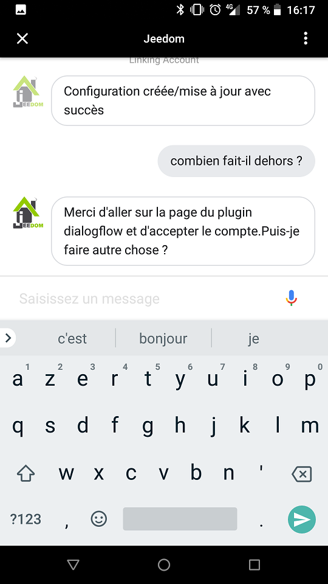
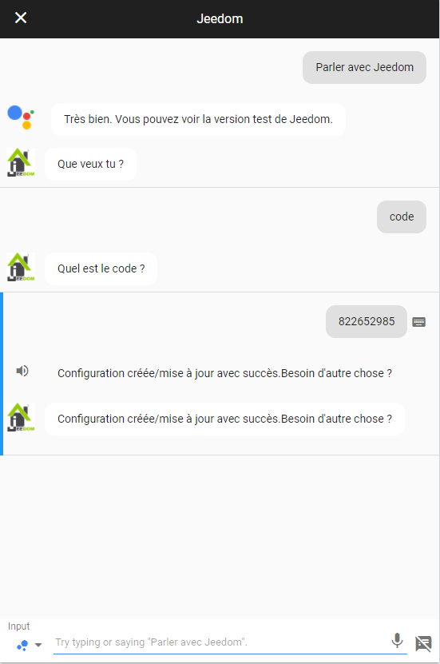

# Présentation

Le plugin dialogflow permet de connecté Jeedom à Google Home par une application native

# Configuration

Installer le plugin et activé le. Ensuite allez sur la page Plugin -> Comminication -> Dialog flow

> **IMPORTANT**
>
> Vous n'avez pas créer d'équipement pour ce plugin il faut juste suivre les instructions

Sur votre google home ou sur un téléphone avec google assistant, dites "parler avec Jeedom" :

Sur votre google home ou sur un téléphone avec google assistant, dites "code" :

Sur Jeedom sur la page du plugin cliquez sur le bouton code :

Et donner le code generé à google home/assistant (le code est valide 5min) :

Retourner sur Jeedom et rafraichissez la page, vous aller avoir une demande d'acceptation d'un utilisateur google, il faut la valider :

